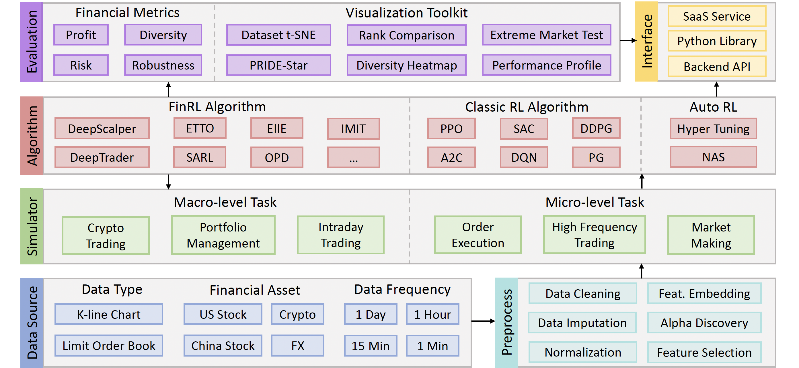

# Introduction

TradeMaster is a first-of-its kind, best-in-class open-source platform for quantitative trading (QT) empowered by reinforcement learning (RL), which covers the full pipeline for the design, implementation, evaluation and deployment of RL-based algorithms.

## Architecture

TradeMaster is composed of 6 key modules: 1) multi-modality market data of different financial assets at multiple granularity; 2) whole data preprocessing pipeline; 3) a series of high-fidelity data-driven market simulators for mainstream QT tasks; 4) efficient implementations of over 13 novel RL-based trading algorithms; 5) systematic evaluation toolkits with 6 axes and 17 measures; 6) different interfaces for interdisciplinary users.

## Model Zoo
[DeepScalper based on Pytorch (Shuo Sun et al, CIKM 22)](https://arxiv.org/abs/2201.09058)

[OPD based on Pytorch (Fang et al, AAAI 21)](https://ojs.aaai.org/index.php/AAAI/article/view/16083)

[DeepTrader based on Pytorch (Wang et al, AAAI 21)](https://ojs.aaai.org/index.php/AAAI/article/view/16144) 

[SARL based on Pytorch (Yunan Ye et al, AAAI 20)](https://arxiv.org/abs/2002.05780)

[ETTO based on Pytorch (Lin et al, 20)](https://www.ijcai.org/Proceedings/2020/627?msclkid=a2b6ad5db7ca11ecb537627a9ca1d4f6)

[Investor-Imitator based on Pytorch (Yi Ding et al, KDD 18)](https://www.kdd.org/kdd2018/accepted-papers/view/investor-imitator-a-framework-for-trading-knowledge-extraction)

[EIIE based on Pytorch (Jiang et al, 17)](https://arxiv.org/abs/1706.10059)

Classic RL based on Pytorch and Ray: 
[PPO](https://docs.ray.io/en/latest/rllib/rllib-algorithms.html#ppo) [A2C](https://docs.ray.io/en/latest/rllib/rllib-algorithms.html#a3c) [Rainbow](https://docs.ray.io/en/releases-1.13.0/rllib/rllib-algorithms.html#dqn) [SAC](https://docs.ray.io/en/latest/rllib/rllib-algorithms.html#sac) [DDPG](https://docs.ray.io/en/latest/rllib/rllib-algorithms.html#ddpg) [DQN](https://docs.ray.io/en/latest/rllib/rllib-algorithms.html#dqn) [PG](https://docs.ray.io/en/latest/rllib/rllib-algorithms.html#pg) [TD3](https://docs.ray.io/en/latest/rllib/rllib-algorithms.html#ddpg)
