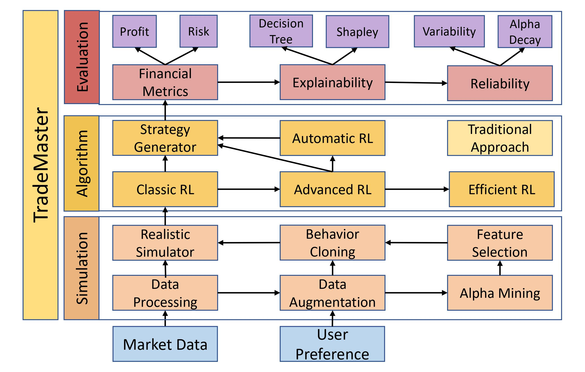

# Introduction

## Architecture

TradeMaster could be beneficial to a wide range of communities including leading trading firms, startups, financial service providers and personal investors. We hope TradeMaster can make a change for the whole pipeline of FinRL to prevent untrustworthy results and lead successful industry deployment. \
Architecture of Trademaster framework could be visualizaed by the figure below.
- Level 1 Simulation

  Market Data and User Preference are fed into the network for data processing. In this step, data preprocessing, mining, augmentation, feature selection and behaviour cloning are performed to provide evident simulation of noisy real-world financial market.

- Level 2 Algorithm 
  
  A collection of various reinforcement learning algotithms are developed to provide feasible solution to different financial tasks like Algorithm Trading, Order Excuction and Porforlio Management. The RL algorithms will generate strategy to maximize user profit.
  
- Level 3 Evaluation

  TradeMaster is evaluated in multiple dimenstions. Financial metrics like profit and risk metrics are applied. Additionally, decision tree and shapley value are used to evaluate the explainability of the model. Variability and Alpha decay are used for reliability evaluation.

## Supported Trading Scenario

### Algorithmic Trading
Algorithmic trading (AT) is a trading scenario that involves using deep reinforcement learning methods to execute trades. This scenario is often used by traders who wish to execute large numbers of trades quickly and efficiently, especially in high-frequency trading.

For more information, please refer to [Algorithmic Trading](https://en.wikipedia.org/wiki/Algorithmic_trading).

### Order Execution
Order execution (OE) is a supported trading scenario that involves placing orders to buy or sell securities. This scenario is often used by traderswho wish to execute trades automatically and optimally.

The kev difference of this 0E and algorithmic trading is that OE can only put an action at one side. For example, if the 0E task is to buy oneshare of BTC, you cannot put an "ask" order even if you stil have BTC in your hand. in 0E, we want to sell at the highest price or buy at thelowest price. Therefore, the optimization target is set to be the amount of money we sel. f the target is buying, our target will be negativeBoth targets will be optimized to their maximum value. All of the trades will be conducted at their closing price.

For more information, please refer to [Order Execution](https://www.investopedia.com/articles/01/022801.asp).

### Portfolio Management
Portfolio management (PM) is a trading scenario that involves managing a collection of investments over time. lt's used by investors who wantto minimize nsk and diversify ther nvestments, This scenano often invo ves a ono-term investment strateoy. rather than tocusind on shortterm trading opportunities.

For more information, please refer to [Order Execution](https://www.investopedia.com/terms/p/portfoliomanagement.asp).

## Model Zoo

### DeepScalper
Please refer to [DeepScalper based on Pytorch (Shuo Sun et al, CIKM 22)](https://arxiv.org/abs/2201.09058) for details.

### OPD
Please refer to [OPD based on Pytorch (Fang et al, AAAI 21)](https://ojs.aaai.org/index.php/AAAI/article/view/16083) for details.

### DeepTrader
Please refer to [DeepTrader based on Pytorch (Wang et al, AAAI 21)](https://ojs.aaai.org/index.php/AAAI/article/view/16144) for details. 

### SARL
Please refer to [SARL based on Pytorch (Yunan Ye et al, AAAI 20)](https://arxiv.org/abs/2002.05780) for details.

### ETTO
Please refer to [ETTO based on Pytorch (Lin et al, 20)](https://www.ijcai.org/Proceedings/2020/627?msclkid=a2b6ad5db7ca11ecb537627a9ca1d4f6) for details.

### Investor-Imitator
Please refer to [Investor-Imitator based on Pytorch (Yi Ding et al, KDD 18)](https://www.kdd.org/kdd2018/accepted-papers/view/investor-imitator-a-framework-for-trading-knowledge-extraction) for details.

### EIIE
Please refer to [EIIE based on Pytorch (Jiang et al, 17)](https://arxiv.org/abs/1706.10059) for details.

### Classic RL based on [Pytorch](https://pytorch.org/docs/stable/index.html) and [Ray](https://docs.ray.io/en/latest/): 
#### PPO
Please refer to [PPO](https://docs.ray.io/en/latest/rllib/rllib-algorithms.html#ppo) for details.

#### A2C
Please refer to [A2C](https://docs.ray.io/en/latest/rllib/rllib-algorithms.html#a3c) for details.

#### SAC
Please refer to [SAC](https://docs.ray.io/en/latest/rllib/rllib-algorithms.html#sac) for details.

#### DDPG
Please refer to [DDPG](https://docs.ray.io/en/latest/rllib/rllib-algorithms.html#ddpg) for details.

#### DQN
Please refer to [DQN](https://docs.ray.io/en/latest/rllib/rllib-algorithms.html#dqn) for details.

#### PG
Please refer to [PG](https://docs.ray.io/en/latest/rllib/rllib-algorithms.html#pg) for details.

#### TD3
Please refer to [TD3](https://docs.ray.io/en/latest/rllib/rllib-algorithms.html#ddpg) for details.
