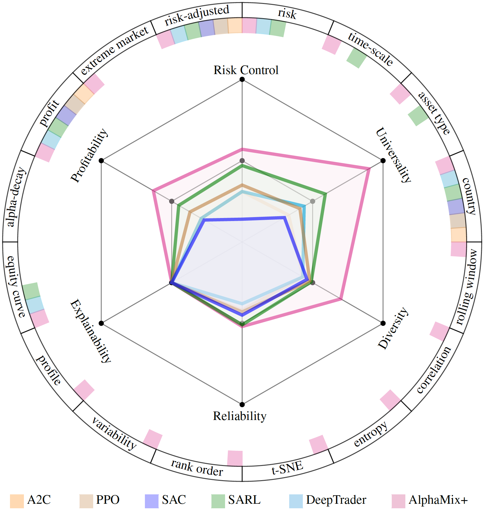
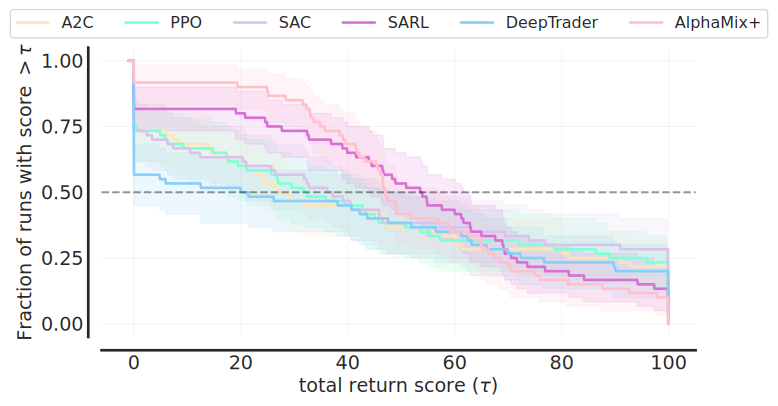
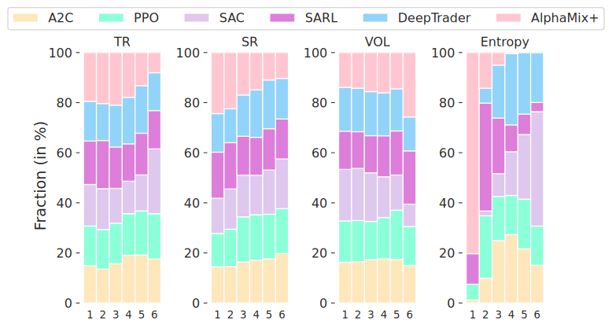

# Evaluation Toolkits: PRUDEX-Compass 

- **PRUDEX-Compass** is designed for **benchmarking** methods with 6 axes and 16 measures.
- This is an official implementation of [PRUDEX-Compass: Towards Systematic Evaluation of Reinforcement Learning in Financial Markets](https://arxiv.org/abs/2302.00586).
- **PRUDEX-Compass** is an independt tool and is not intergarted in the pipline for now.
- We use **FinRL** methods to demonstrate how **PRUDEX-Compass** works.


## Install
To install the dependency of `PRUDEX-Compass`, run the command:
```
pip install -r requirements.txt
```
## Usages and Examples

### PRUDEX-Compass 
- The PRUDEX-Compass gives high-level evaluations 
- Use the [`create_compass.py`](https://github.com/ai-gamer/PRUDEX-Compass/blob/main/Compass/generate/compass/create_compass.py) python script to fill in the templet and get the compass. 

<div align="center">
  
</div>

#### Example Usage 
The default setting reads the template file from [`blank.tex`](https://github.com/ai-gamer/PRUDEX-Compass/blob/main/Compass/generate/compass/blank.tex) and writes the filled output file into [`filled.tex`](https://github.com/ai-gamer/PRUDEX-Compass/blob/main/Compass/generate/compass/filled.tex) with the data specified via --data <JSON_FILE>:
```
$ python Compass/generate/compass/create_compass.py--data Compass/generate/compass/data.json
```
The result is an .tex file [`filled.tex`](https://github.com/ai-gamer/PRUDEX-Compass/blob/main/Compass/generate/compass/filled.tex) 
#### JSON Data Format
The JSON file specifies a list of entries, where each element defines a `color`, `label`, `inner_level`, and `outer_level`. The latter two specify the attributes visualized in the compass.

`color`: Can be one of `["magenta", "green", "blue", "orange", "cyan", "brown"]`.

`label`: A label describing the compass entry.

`inner_level`: Specifies the inner compass level attributes. Attribute values must be between 1 and 100.

`outer_level`: Specifies the outer compass level attributes. Attribute values must boolean `(true/false)`.

We provide an example data file [`Compass/generate/compass/data.json`](https://github.com/ai-gamer/PRUDEX-Compass/blob/main/Compass/generate/compass/data.json)


### PRIDE-Star
- The PRIDE-Star gives metric-level evaluation of profitability,risk-control and diversity
<table align="center">
    <tr>
        <td ><center>   </center></td>
        <td ><center> </center></td>
        <td ><center> </center></td>
    </tr>
    <tr>
     <td align="center"><center>(a) A2C</center></td><td align="center"><center>(b) PPO</center></td>      <td align="center"><center>(c) SAC</center></td>                   
    </tr>
    <tr>
        <td ><center> </center></td>
        <td ><center> </center></td>
        <td ><center>  </center></td>
    </tr>
    <tr>
     <td align="center"><center>(d) SARL</center></td><td align="center"><center>(e) DeepTrader</center></td>      <td align="center"><center>(f) AlphaMix+</center></td>                   
    </tr>
</table>


<div STYLE="page-break-after: always;"></div>

The file structure of templates for `PRIDE-Star` is as following:
```
-- PRIDE-Star 
    |-- A2C.tex
    |-- Alphamix+.tex
    |-- DeepTrader.tex
    |-- PPO.tex
    |-- SAC.tex
    |-- SARL.tex
    |-- blank.tex
```
Here we provide a [blank tex](https://github.com/ai-gamer/PRUDEX-Compass/blob/main/Compass/generate/PRIDE-Star/blank.tex) that you can play with

### Performance Profile
- The performance profile reports methods' score distribution of all runs across the different 
financial markets that are statistically unbiased and more robust to outliers.

<div align="center">
  
</div>


#### Example usage 
Prepare your result as `overall_dict={method name:result(seed,task)}` and use the following example code
to generate the distribution. Notice that we only use one metrics (`total return`) in the example.

```
import numpy as np
import pandas as pd
import matplotlib.pyplot as plt
import scipy.stats
from rliable import library as rly
from rliable import metrics
from rliable import plot_utils
import seaborn as sns
sns.set_style("white")
import matplotlib.patches as mpatches
import collections
import os
from Compass.distribution.distribution import make_distribution_plot
colors = ['moccasin','aquamarine','#dbc2ec','orchid','lightskyblue','pink','orange']
xlabels = ['A2C','PPO','SAC','SARL','DeepTrader',"AlphaMix+"]
color_idxs = [0, 1,2,3,4,5,6]
ATARI_100K_COLOR_DICT = dict(zip(xlabels, [colors[idx] for idx in color_idxs]))
from scipy.stats.stats import find_repeats
xlabel=r'total return score $(\tau)$',
dict=tt_dict_crypto
algorithms = ['A2C','PPO','SAC','SARL','DeepTrader',"AlphaMix+"]
make_distribution_plot(dict,algorithms,2000,xlabel,"./distribution",ATARI_100K_COLOR_DICT)
```

For more precise information, please refer to [`Compass/generate/distribution/distribution.py`](https://github.com/ai-gamer/PRUDEX-Compass/blob/main/Compass/generate/distribution/distribution.py)

### Rank Distribution
- This visualization shows the distribution of methods' performance ranking.


<div align="center">
  

</div> 

#### Example usage 
Prepare result into `dmc_scores={metric name: metric result dictionary}` and use the following example code
to generate the graph.

```
from Compass.generate.rank.rank import subsample_scores_mat,get_rank_matrix,make_rank_plot
dmc_scores = {}
dmc_scores["TR"]=tt_dict
dmc_scores["SR"]=sr_dict
dmc_scores["CR"]=cr_dict
dmc_scores["SoR"]=sor_dict
dmc_scores["VOL"]=vol_dict
dmc_scores["Entropy"]=Entropy_dict
indicator_list=['TR','SR','VOL','Entropy']
algs=['A2C','PPO','SAC','SARL','DeepTrader','AlphaMix+']
colors=['moccasin','aquamarine','#dbc2ec','salmon','lightskyblue','pink','orange']
make_rank_plot(algs,indicator_list,".rank.pdf",colors)
```
For more information, please refer to [`rank.py`](https://github.com/ai-gamer/PRUDEX-Compass/blob/main/Compass/generate/rank/rank.py)
### Performance under Extreme Markets
- The performance under extreme markets reflects methods' ability to deal with black swan events in terms of total return and sharpe ratio compared with uniform policy.
<div align="center">
  
</div> 


#### Example usage 

Select a volatile period and get the daily return rate and use the following example code
to generate the graph.

```
from Compass.generate.exen.exen import evaualte,plot_pictures
A2C=pd.read_csv("./A2C.csv",index_col=0)
SARL=pd.read_csv("./SARL.csv",index_col=0)
DeepTrader=pd.read_csv("./DeepTrader.csv",index_col=0)
PPO=pd.read_csv("./PPO.csv",index_col=0)
SAC=pd.read_csv("./SAC.csv",index_col=0)
AlphaMix=pd.read_csv("AlphaMix+.csv",index_col=0)
path=".exen.pdf"
plot_pictures(new_models,path)
```
For more information, please refer to [`exen.py`](https://github.com/ai-gamer/PRUDEX-Compass/blob/main/Compass/generate/exen/exen.py)

## Acknowledgements
This repository is developed based on:
[RLKit](https://github.com/rail-berkeley/rlkit),
[FinRL](https://github.com/AI4Finance-Foundation/FinRL),
[Sunrise](https://github.com/pokaxpoka/sunrise)
