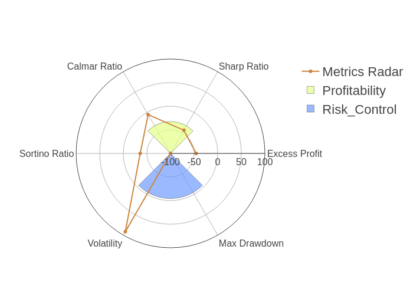

# Evaluation Toolbox: Market Dynamics Modeling

## Introduction 
The evaluation toolbox provides a sandbox for user to evaluate their policy under different scenarios . 
The toolbox shows visualizations and reports to assist user compare policies across market dynamic.

## Market Dynamics Modeling
The Market Dynamics modeling is a module to label raw data with dynamics that is interpretable. 
The dynamics are used as meta-information. For example, in the evaluation process, user can run evaluation on specific dynamics.

## Usage & Example
The Evaluation Toolbox module prepare data for evaluation, to run a full test you should follow this pipeline:
- Run the [`run.py`]()  in tools/market_dynamics_labeling or [`run_linear_model.py`]() to prepare the dataset
  1. Tune the parameters based on the visualization results
     <div align="center">
       
     </div>
  1. Increase `length_limit`
      <div align="center">
       
      </div>
  1. Modify `labeling_parameters`
      <div align="center">
        
      </div> 
- Update the 'test_style_path' in the config files to the dataset path you get from previous step.

- Run the trainer with arguments `--task dynamics_test --test_dynamic dynamic_label` to perform evaluation on specific market dynamic. You will get reports and visualization result.
  <div align="center">
          
        </div> 
#### Parameters 
- `fitting_parameters`: This is a set of parameters for the filter, please refer to the comment in lines for detailed description. 
- `labeling_parameters`: This is a set of parameters for regime classification, please refer to the comment in lines for detailed description. 
- `regime_number`: This is the number of regimes. 
- `length_limit`: This is the minimum length of a consecutive time-series of same regime. 

#### Scoring
The scores of the visualization result are calculated as described:
- Do nothing metrics are used as score 0
- Blind Buy metrics are used as score 50 (-50 if worse than Do Nothing)
- The score of other agents are given based on the assumption that the scores are following a normal distribution (50,$\sqrt{50}$)
##### Baselines
  - Buy and Hold: This is and ideal policy where you spend all your cash on the first tick.
  - Blind Buy: Continues buy until the cash runs out.
  - Do Nothing: Do nothing


## Examples
### Use Market Dynamics Model to prepare evaluation datasets
It is recommended to run through the trademaster/evaluation/market_dynamics_labeling/example.ipynb notebook to visualize the labeling process. This will also give hints on
deciding the parameters for your dataset. The example.html contains the visualization results from example.ipynb.
#### Running from configuration file 
Change the parameters in `configs/evaluation/market_dynamics_modeling.py` and run 
```
$ python tools/market_dynamics_labeling/run.py
```
#### Running from command lines 
An example of labeling the data
<br />
   ```
  $ python trademaster/evaluation/market_dynamics_labeling/model/run_linear_model.py --data_path data/algorithmic_trading/BTC/test.csv --method linear --fitting_parameters 2/7 2/14 4 --labeling_parameters -0.5 0.5
   ```
FX
```
$ python trademaster/evaluation/market_dynamics_labeling/model/run_linear_model.py --data_path data/algorithmic_trading/FX/test.csv --method linear --fitting_parameters 2/7 2/14 4 --labeling_parameters -0.05 0.05 --regime_number 3 --length_limit 24
```
DJ30
    ```
  $ python trademaster/evaluation/market_dynamics_labeling/model/run_linear_model.py --data_path data/portfolio_management/dj30/test.csv --method linear --fitting_parameters 2/7 2/14 4 --labeling_parameters -0.25 0.25 --regime_number 3 --length_limit 24
    ```
for DJ30 applied in PM use-case, we would like to define the market regime based on DJ30 index. We have provided an example of
test_labeled_3_24.csv which is DJI_labeled_3_24.csv and test.csv merged on 'date' where  DJI_labeled_3_24.csv is got from running 

DJI index
   ```
   $ python trademaster/evaluation/market_dynamics_labeling/model/run_linear_model.py --data_path  data/portfolio_management/dj30/DJI.csv --method linear --fitting_parameters 2/7 2/14 4 --labeling_parameters -0.25 0.25  --regime_number 3 --length_limit 24  --PM data/portfolio_management/dj30/test.csv
   ```

BTC 

    $ python trademaster/evaluation/market_dynamics_labeling/model/run_linear_model.py --data_path data/algorithmic_trading/BTC/test.csv --method linear --fitting_parameters 2/7 2/14 4 --labeling_parameters -0.15 0.15 --regime_number 3 --length_limit 24
PD_BTC

    $ python trademaster/evaluation/market_dynamics_labeling/model/run_linear_model.py --data_path data/order_execution/PD_BTC/test.csv --method linear --fitting_parameters 2/7 2/14 4 --labeling_parameters -0.15 0.15 --regime_number 3 --length_limit 24

high_frequency_trading small_BTC
    
    $ python trademaster/evaluation/market_dynamics_labeling/model/run_linear_model.py --data_path data/high_frequency_trading/small_BTC/test.csv --method linear --fitting_parameters 2/7 2/14 4 --labeling_parameters -0.01 0.01 --regime_number 3 --length_limit 300


OE_BTC

    $ python trademaster/evaluation/market_dynamics_labeling/model/run_linear_model.py --data_path data/order_execution/BTC/test.csv --method linear --fitting_parameters 2/7 2/14 4 --labeling_parameters -0.01 0.01 --regime_number 3 --length_limit 32 --OE_BTC True

Exchange

    $ python trademaster/evaluation/market_dynamics_labeling/model/run_linear_model.py --data_path data/portfolio_management/exchange/test.csv --method linear --fitting_parameters 2/7 2/14 4 --labeling_parameters -0.05 0.05 --regime_number 3 --length_limit 24
 

<br />


The script will take in a data file and output the file with a market regime label column. Besides the market label, we also provide a stock group label column based on DWT clustering.

### Testing agent under a specific market dynamic
```
$ python tools/algorithmic_trading/train.py --task_name dynamics_test --test_dynamic 0
```

## Try out the pipeline online 
Check our [online platform](http://trademaster.ai/) for more information.


