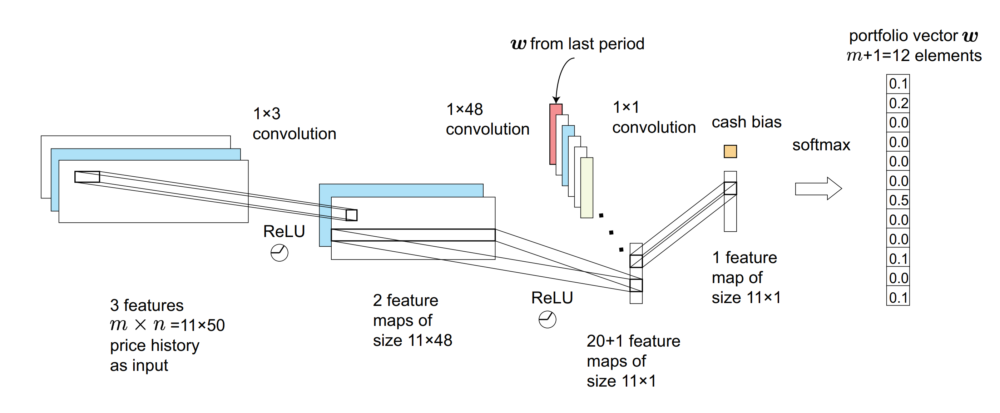

# Tutorial 1: Portfolio Management with EIIE on US stocks

Portfolio management is the action of continuous reallocation of a capital into a number of financial assets periodically.

The framework consists of the Ensemble of Identical Independent Evaluators
(EIIE) topology, a Portfolio-Vector Memory (PVM), an Online Stochastic Batch Learning
(OSBL) scheme, and a fully exploiting and explicit reward function.

In this notebook, we implement the training and testing process of EIIE based on the TradeMaster framework.

[Tutorial1_EIIE](https://github.com/TradeMaster-NTU/TradeMaster/blob/main/tutorial/Tutorial1_EIIE.ipynb)

And this is the script for training and testing.

[train_eiie.py](https://github.com/TradeMaster-NTU/TradeMaster/blob/1.0.0/tools/portfolio_management/train_eiie.py)