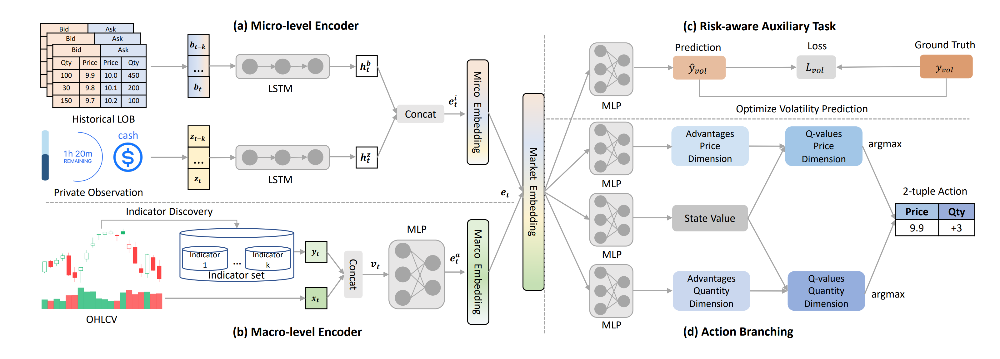

# Tutorial 1: Intraday Crypto Trading with DeepScalper

## Task
Intraday trading is a fundamental quantitative trading task, where traders actively long/short one pre-selected financial asset within the same trading day to maximize future profit.

## Algorithm
DeepScalper contains 4 technical contributions which all together make it better than direct use of RL algorithms.
- RL optimization with action branching
- reward function with hindsight bonus
- intraday market embedding
- risk-aware auxiliary task

Here is the construction of the DeepScalper:

  

Here is a [tutorial](https://github.com/DVampire/TradeMasterReBuild/tree/main/tutorial/DeepScalper.ipynb) about how you can build DeepScalper in a few lines of codes using TradeMaster.