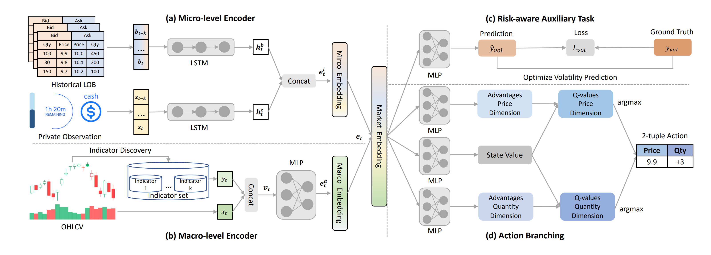

# Tutorial 2: Intraday Crypto Trading with DeepScalper

Intraday trading is a fundamental quantitative trading task, where traders actively long/short one pre-selected financial asset within the same trading day to maximize future profit.

DeepScalper use deep q network to optimize the reward sum got from reinforcement learning where a hindsight reward is used to capture the long-term porfit trends and embedding from both micro-level and macro-level market information.

In this notebook, we implement the training and testing process of DeepScalper based on the TradeMaster framework.

[Tutorial2_DeepScalper](https://github.com/TradeMaster-NTU/TradeMaster/blob/main/tutorial/Tutorial2_DeepScalper.ipynb)

And this is the script for training and testing.

[train.py](https://github.com/TradeMaster-NTU/TradeMaster/blob/1.0.0/tools/algorithmic_trading/train.py)