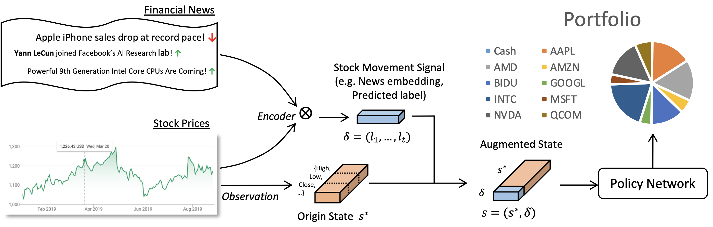

# Tutorial 3: Portfolio Management with SARL

SARL proposed State Augmented Reinforcement Learning (SARL) method. Asset prices (e.g., stock
prices) represent the internal features constituting the original state s', and Financial News represent the external information
to be encoded and augmented to the final state s for SARL. The asset movement signal δ is used for state augmentation and the
policy network will generate the portfolio management strategy from the augmented state s.

In this notebook, we implement the training and testing process of SARL based on the TradeMaster framework.

[Tutorial3_SARL](https://github.com/TradeMaster-NTU/TradeMaster/blob/main/tutorial/Tutorial3_SARL.ipynb)

And this is the script for training and testing.

[train_sarl.py](https://github.com/TradeMaster-NTU/TradeMaster/blob/main/tutorial/Tutorial3_SARL.ipynb)
