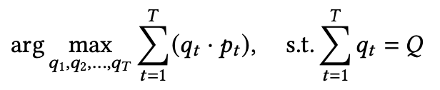

# Tutorial 4: Order Execution with ETTO

## Order Execution

Formally, OE is to trade fixed amount of shares within a predetermined time horizon (e.g., one hour or one day). At each time step 𝑡 , traders can propose to trade a quantity of 𝑞𝑡 ≥ 0 shares at current market price 𝑝𝑡 , The matching system will then return the execution results at time 𝑡 + 1. Taking the sell side as an example, assuming a total of Q shares required to be executed during the whole time horizon, the OE task can be formulated as:

OE not only completes the liquidation requirement but also the maximize/minimize average execution price for the sell/buy side execution respectively.

## ETEO

ETEO is an end-to-end adaptive framework for optimal trade execution based on Proximal Policy Optimization (PPO).Two methods to account for the time dependencies in the market data based on two different neural networksarchitecture: 1) Long short-term memory (LSTM) networks, 2) Fully-connected networks (FCN) by stacking the most recent limit order book (LOB) information as model inputs. The proposed framework can make trade execution decisions based on level-2 limit order book (LOB) information such as bid/ask prices and volumes directly without manually designed attributes as in previous research. 

## Notebook and Script

In this notebook, we implement the training and testing process of ETEO based on the TradeMaster framework.

[Tutorial4_ETEO](https://github.com/TradeMaster-NTU/TradeMaster/blob/main/tutorial/Tutorial4_ETEO.ipynb)

And this is the script for training and testing.

[train_eteo.py](https://github.com/TradeMaster-NTU/TradeMaster/blob/main/tutorial/Tutorial4_ETEO.ipynb)
