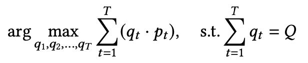

# Tutorial 5: Order Execution with ETTO

ETTO is an end-to-end adaptive framework for optimal trade execution based on Proximal Policy Optimization (PPO).Two methods to account for the time dependencies in the market data based on two different neural networksarchitecture: 1) Long short-term memory (LSTM) networks, 2) Fully-connected networks (FCN) by stacking the most recent limit order book (LOB) information as model inputs. The proposed framework can make trade execution decisions based on level-2 limit order book (LOB) information such as bid/ask prices and volumes directly without manually designed attributes as in previous research. 

In this notebook, we implement the training and testing process of ETEO based on the TradeMaster framework.

[Tutorial5_ETEO](https://github.com/TradeMaster-NTU/TradeMaster/blob/main/tutorial/Tutorial5_ETTO.ipynb)

